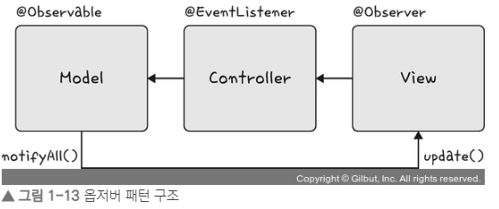

# 옵저버 패턴
#### 주체 : 객체에 관찰자 역할을 하면서 상태변화에 따라 전달되는 메소드를 기반으로 추가 변화 사항이 생기는 객체

- 객체와 주체가 분리되어 객체의 상태 변화가 있을 때마다 메소드 등을 통해 옵저버들에게 변화를 알려주는 디자인 패턴
- 주체, 객체 같이 두고 상태가 변경되는 객체를 기반으로 구축하기도 함

- 
##### 옵저버 패턴 예시) 트위터에 팔로우 팔로워 기능
- 주로 이벤트 기반 시스템에 사용, MVC 패턴에도 사용


```
import java.util.ArrayList;
import java.util.List;

interface Subject {
    public void register(Observer obj);
    public void unregister(Observer obj);
    public void notifyObservers();
    public Object getUpdate(Observer obj);
}

interface Observer {
    public void update(); 
}

class Topic implements Subject {
    private List<Observer> observers;
    private String message;

    public Topic() {
        this.observers = new ArrayList<>();
        this.message = "";
    }

    @Override
    public void register(Observer obj) {
        if (!observers.contains(obj)) observers.add(obj); 
    }

    @Override
    public void unregister(Observer obj) {
        observers.remove(obj); 
    }

    @Override
    public void notifyObservers() {
        this.observers.forEach(Observer::update); 
    }

    @Override
    public Object getUpdate(Observer obj) {
        return this.message;
    } 
    
    public void postMessage(String msg) {
        System.out.println("Message sended to Topic: " + msg);
        this.message = msg; 
        notifyObservers();
    }
}

class TopicSubscriber implements Observer {
    private String name;
    private Subject topic;

    public TopicSubscriber(String name, Subject topic) {
        this.name = name;
        this.topic = topic;
    }

    @Override
    public void update() {
        String msg = (String) topic.getUpdate(this); 
        System.out.println(name + ":: got message >> " + msg); 
    } 
}

public class HelloWorld { 
    public static void main(String[] args) {
        Topic topic = new Topic(); 
        Observer a = new TopicSubscriber("a", topic);
        Observer b = new TopicSubscriber("b", topic);
        Observer c = new TopicSubscriber("c", topic);
        topic.register(a);
        topic.register(b);
        topic.register(c);

        topic.postMessage("amumu is op champion!!"); 
    }
}
/*
Message sended to Topic: amumu is op champion!!
a:: got message >> amumu is op champion!!
b:: got message >> amumu is op champion!!
c:: got message >> amumu is op champion!!
*/
```

- topic 기반 옵저버 패턴
- topic : 주체이자 객체

## 상속과 구현
### 상속
자식 클래스가 부모 클래스의 메소드 등을 상속받아 사용하여 자식 클래스에서 추가 및 
확장을 할 수 있는 것, 재상용성, 중복성의 최소화

### 구현 
부모 인터페이스를 자식 클래스에서 재정의하여 구현하는 것, 메소드 재정의해야함

