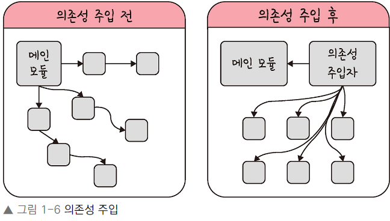

# 디자인 패턴과 프로그래밍 패러다임


|           라이브러리            |        프레임워크        |
|:--------------------------:|:-------------------:|
| 공통으로 사용될 수 있는 특정한 기능들을 모듈화 ||
|        규칙이 비교적 자유롭다        |    규칙이 비교적 엄격하다     |
|         내가 직접 컨트롤          | 도구가 컨트롤을 해주는 느낌 |

## 디자인 패턴
프로그램을 설계할 때 발생했던 문제점들을 객체 간의 상호 관계 등을 이용하여 해결할 수 있도록 하나의 규약 형태로 만들어 놓은 것을 의미

### 싱글톤 패턴
- 하나의 클래스에 오직 하나의 인스턴스만 가지는 패턴
- 데이터베이스 연결 모듈에 많이 사용
- 비용이 줄어듬 -> 하나의 인스턴스를 만들어 놓고 공유하는 시스템
- 의존성이 높아짐
```java
// 자바에서의 싱글톤 패턴
class Singleton{
    public static class singleInstanceHolder {
        public static final Singleton INSTANCE = new Singleton();
    }
    public static synchronized  Singleton getInstance(){
        return singleInstanceHolder.INSTANCE;
    }
}
public class HelloWorld{
    public static void main(String[] args) {
        Singleton a = Singleton.getInstance();
        Singleton b = Singleton.getInstance();
        System.out.println(a.hashCode());
        System.out.println(b.hashCode());
        if (a == b){
            System.out.println(true);
        }
    }
}
 // 705927765
 // 705927765
 // true
```

### 싱글톤 패턴의 단점
TDD 단위 테스트를 할 때는 테스트가 서로 독립적이어야 하며, 어떤 순서로든 실행할 수 있어야 하는데 '독립적인' 인스턴스를 만들기 어려움

### 의존성 주입
1. 사용하기 쉽고 굉장히 실용적이지만 모듈 간의 결합을 강하게 만들 수 있다
2. 의존성 주입을 통해 모듈 간의 결합을 조금 느슨하게 만들어 해결할 수 있다
3. 의존성 = 종속성, A가 B에 의존성이 있다는 것 == B의 변경 사항에 대해 A또한 변해야 된다 

4. 메인 모듈이 직접 의존성 주기 X 의존성 주입자가 간접적 의존성 주입 방법
=> 디커플링이 된다

#### 장점
- 모듈들을 쉽게 교체할 수 있는 구조가 되어 테스팅하기 쉽고 마이그레이션 수월
- 구현할 때 추상화 레이어를 넣고 이를 기반으로 구현체를 넣어 주기 때문에 애플리케이션 의존성 방향 일관, 쉽게 추론 가능, 모듈 관계 명확성 ↑

#### 단점
- 모듈들이 더욱 분리되어 클래스 수가 늘어나 복장성↑ -> 약간의 런타임 패널티 생길 수 있음

#### 의존성 주입 원칙
상위 모듈은 하위 모듈에서 어떠한 것도 가져오지 않아야 한다.
둘 다 추상화에 의존해야 하며, 이때 추상화는 세부 사항에 의존하지 말아야 한다

